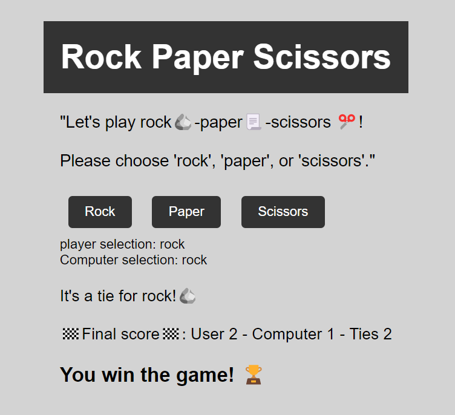

# Rock-Paper-Scissors

A simple implementation of grade-school classic “rock paper scissors”. &nbsp;&nbsp;&nbsp;&nbsp; [Click here for live preview](https://abuusaid.github.io/Rock-Paper-Scissors/)

The game is implemented using HTML, CSS, and JavaScript. The HTML file (index.html) contains the game interface, which consists of three buttons for the user to select their choice, as well as a container to display the current round results and score.

The JavaScript code (game.js) contains the game logic. When the user clicks on a button, the corresponding choice is stored in a variable. The computer's choice is generated randomly using the Math.random() function. The winner of the round is then determined using a series of if statements based on the classic game rules.

The game keeps track of the current score and number of rounds played using variables, and updates the display after each round. Once 5 rounds have been played, the game is over and the final score and result are displayed.
